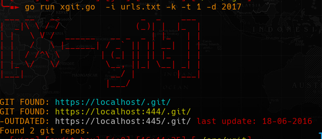

# X-GIT



Scan for exposed git repositories.

## Usage:

```
-h, --help                     Show this help
-t, --thread      NBR          Number of threads (default 50)
-o, --output      FILE         Output file (default found_git.txt)
-d, --check-date  DATE         Only repo after date (mm-dd-yyyy, yyyy, mm-yyyy)
-i, --input       FILE         Input file
-k, --insecure                 Ignore certificate errors
-T, --timeout     SEC          Set timeout (default 5s)
-u, --user-agent  USR-AGENT    Set user agent
-p, --proxy       PROXY        Use proxy (proto://ip:port)
-V, --version                  Print version and exit
```

## Examples:

```sh
$ xgit -i top-alexa.txt
$ xgit -i top-alexa.txt -k -d 2021
$ xgit -p socks5://127.0.0.1:9050 -o good.txt -i top-alexa.txt -t 60
```

**Example of input file:**

```
google.com
github.com
domain.com/code
```

**note:** domain in list shouldn't have protocol in them:

 
```go
req, err := http.NewRequest("GET", "https://"+url+"/.git/", nil)
```


#### OUTPUT FILE:

Urls with `[nd] ` prefix are exposed git repository but without directory listing.


#### STDOUT

In stdout urls in cyan are git repository where directory listing is enable and yellow ones are when directory listing is disable.


#### WARNING

Do not use too much threads or you will DOS yourself.


## Install:

With one liner if **$GOROOT/bin/** is in **$PATH**:

```sh
go install github.com/mmpx12/xgit@latest
```

or from source with:

```sh
git clone https://github.com/mmpx12/xgit.git
cd xgit
make
sudo make install
# or 
sudo make all
```

for **termux** you can do:

```sh
git clone https://github.com/mmpx12/xgit.git
cd xgit
make
make termux-install
# or
make termux-all
```


There is also prebuild binaries [here](https://github.com/mmpx12/xgit/releases/latest).
